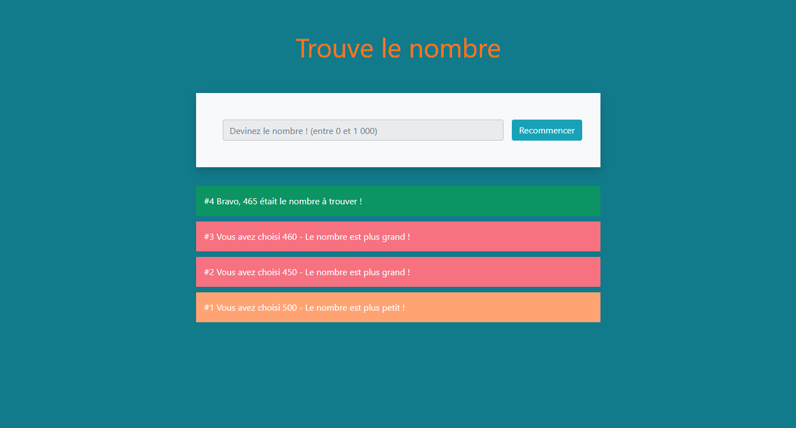

# Trouve le nombre en JavaScript

## Description
**Trouve le nombre en JavaScript** est un jeu interactif développé en HTML, CSS et JavaScript. L'application génère un nombre mystère compris entre 1 et 1000, et le joueur doit deviner ce nombre. À chaque tentative, l'application indique si le nombre mystère est plus petit ou plus grand que le nombre proposé. Une fois le nombre trouvé, le joueur gagne et l'application le notifie.

## Fonctionnalités
- Génération d'un nombre aléatoire entre 1 et 1000.
- Validation de l'entrée utilisateur pour s'assurer qu'il s'agit bien d'un nombre.
- Indication visuelle et textuelle pour guider le joueur (plus grand, plus petit).
- Notification de victoire lorsque le nombre est trouvé.
- Interface utilisateur simple et intuitive.

## Aperçu



## Technologies utilisées
- HTML5
- CSS3
- JavaScript

## Installation
1. Clonez le dépôt sur votre machine locale :
    ```sh
    git clone https://github.com/Github-MitchD/Trouve-le-nombre-en-JS.git
    ```
2. Ouvrez le fichier `index.html` dans votre navigateur préféré pour commencer à jouer.

## Utilisation
1. Ouvrez le fichier `index.html` dans un navigateur web.
2. Entrez un nombre dans le champ de saisie et cliquez sur le bouton "Deviner".
3. Suivez les instructions affichées pour deviner le nombre mystère.

## Structure du projet
- `.gitattributes` : Configuration des attributs Git.
- `index.html` : Fichier HTML principal contenant la structure de l'application.
- `README.md` : Documentation du projet.
- `script.js` : Script JavaScript contenant la logique du jeu.
- `styles.css` : Feuille de style CSS pour la mise en page et le design.

## Contribuer
Les contributions sont les bienvenues ! Si vous souhaitez améliorer ce projet, veuillez suivre ces étapes :
1. Fork le projet.
2. Créez une branche pour votre fonctionnalité (`git checkout -b feature/AmazingFeature`).
3. Commitez vos modifications (`git commit -m 'Add some AmazingFeature'`).
4. Poussez votre branche (`git push origin feature/AmazingFeature`).
5. Ouvrez une Pull Request.

## Auteur
- [Michel Dufour - Développeur Web](https://micheldufour.fr/)

## Licence
Ce projet est sous licence MIT - voir le fichier [LICENSE](LICENSE) pour plus de détails.

## Remerciements
- Merci à tous ceux qui ont contribué à ce projet.
- Merci à la communauté open-source pour l'inspiration et le soutien.
